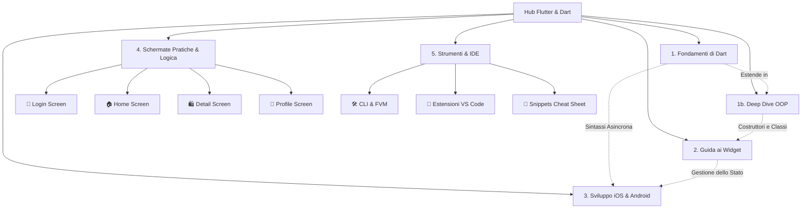

# Hub di Sviluppo Flutter & Dart

Benvenuto nella wiki dedicata allo sviluppo di applicazioni cross-platform per iOS e Android utilizzando **Flutter** e il linguaggio **Dart**. Questa raccolta di note è strutturata per essere interamente navigabile all'interno di Obsidian.

---

## 🗺️ Mappa dei Contenuti

Seleziona un argomento per iniziare l'esplorazione:

### 1. 🎯 [Fondamenti di Dart](./dart_fondamenti.md)
*Impara le basi del linguaggio prima di costruire la tua interfaccia utente.*
*   Variabili, costanti (`final`, `const`) e tipi di dato.
*   **Null Safety** rigorosa e operatori associati.
*   Funzioni (parametri nominati e posizionali).
*   **Asincronia** (`Future` e `Stream`).

### 1b. 🏛️ [OOP in Dart](./dart_oop.md)
*Il paradigma alla base del framework: come strutturare classi ed oggetti.*
*   Classi, costruttori ed attributi.
*   Membri **pubblici e privati** (l'uso di `_`).
*   Integrità dei dati con **Getter e Setter**.
*   Ereditarietà, polimorfismo ed override dei metodi.
*   Costruttori speciali: `const` e `factory`.
*   **Best practices OOP** per codice riutilizzabile e pulito.

### 2. 🧱 [Widget Principali in Flutter](./widget_principali.md)
*Il cuore dell'interfaccia utente: scopri come comporre le schermate.*
*   Differenze tra `StatelessWidget` e `StatefulWidget` con relativi cicli di vita.
*   Widget strutturali (`Scaffold`, `AppBar`).
*   Dimensionamento e spaziamento (`Container`, `Padding`, `SizedBox`).
*   Layout complessi (`Row`, `Column`, `Stack`).
*   Liste performanti (`ListView.builder`).
*   Interazioni fisiche (`GestureDetector` e pulsanti).

### 3. 📱 [Tecniche di Sviluppo iOS e Android](./sviluppo_ios_android.md)
*Best practice e architetture per la pubblicazione su store reali.*
*   Pattern di **State Management** (Riverpod, BLoC, Provider).
*   UI Adattiva per iOS/Android e layout responsivi.
*   Integrazione di codice nativo con i **Method Channels**.
*   Ottimizzazioni delle performance per evitare il *jank*.
*   Preparazione e deployment sugli store (App Store e Google Play).

### 4. 💻 [Schermate Esempio con Logica Pratica](./schermata_login.md)
*Codice Flutter completo e commentato per comprendere come unire layout e logica.*
*   🔐 **[Schermata di Login](./schermata_login.md)**: Validazione dei form, controller di testo, stati di caricamento ed eccezioni grafiche.
*   🏠 **[Schermata Home / Dashboard](./schermata_home.md)**: Menu di navigazione inferiore, griglie dinamiche (`GridView.builder`) e logica di filtraggio dei dati.
*   🛍️ **[Schermata di Dettaglio](./schermata_dettaglio.md)**: Transizioni fluide con `Hero` widget, passaggio di dati e calcolo del carrello.
*   👤 **[Schermata Profilo / Impostazioni](./schermata_profile.md)**: Gestione delle preferenze (Switch) e toggle dello stato tra modalità di lettura e modifica dati.

### 5. 🛠️ [Strumenti di Sviluppo & CLI](./flutter_cli_fvm.md)
*Tutto quello che serve per configurare l'ambiente e ottimizzare la produttività.*
*   🛠️ **[Flutter CLI & FVM](./flutter_cli_fvm.md)**: Comandi di diagnostica, debug, build e gestione di più SDK Flutter contemporaneamente.
*   🔌 **[Strumenti VS Code per Flutter](./vscode_flutter_tools.md)**: Scorciatoie per refactoring automatico, ispezione grafica della UI e debugging delle performance.
*   📝 **[Scorciatoie Widget Snippets](./vscode_widget_snippets.md)**: Cheat sheet completo delle abbreviazioni per generare istantaneamente codice boilerplate in VS Code.

---

## 🚀 Percorso di Apprendimento Consigliato

1.  Comprendi a fondo la sintassi del linguaggio in [Fondamenti di Dart](./dart_fondamenti.md).
2.  Approfondisci le regole della programmazione ad oggetti in [OOP in Dart](./dart_oop.md).
3.  Impara a comporre la UI studiando i [Widget Principali](./widget_principali.md).
4.  Vedi la teoria in pratica studiando le **[Schermate Esempio](./schermata_login.md)**.
5.  Configura l'ambiente e velocizza lo sviluppo studiando gli **[Strumenti & CLI](./flutter_cli_fvm.md)**.
6.  Approfondisci l'architettura professionale e il rilascio in [Tecniche di Sviluppo](./sviluppo_ios_android.md).
