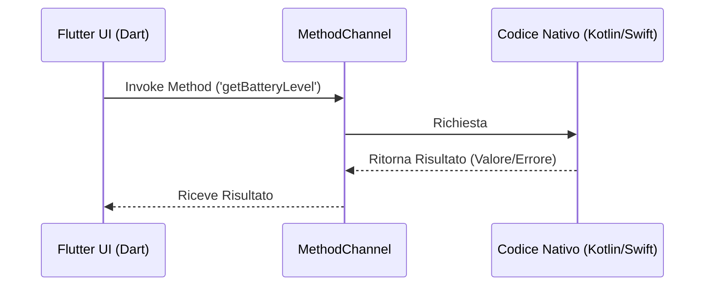

# 📱 Tecniche di Sviluppo per iOS e Android in Flutter

[← Guida ai Widget](./widget_principali.md) | [Torna all'Hub](./index.md)

---

Flutter consente di compilare applicazioni nativamente per iOS e Android a partire da un'unica codebase. Tuttavia, per creare applicazioni professionali e dalle elevate prestazioni, è fondamentale adottare tecniche e pattern architetturali specifici per la gestione della natura multi-piattaforma.

---

## 1. Architettura e Gestione dello Stato (State Management)

La gestione dello stato è cruciale per separare la logica di business dall'interfaccia utente (UI) e garantire la manutenibilità e testabilità dell'app. Un'architettura solida evita l'abuso del metodo `setState()` nei widget complessi (leggi i rischi in [StatefulWidget](./widget_principali.md#1-statelesswidget-vs-statefulwidget)).

### I Pattern di State Management più Diffusi
1.  **Riverpod:** Evoluzione del pattern Provider. È fortemente tipizzato, compile-safe e non dipende dall'albero dei widget per accedere ai dati.
2.  **BLoC (Business Logic Component):** Basato su flussi di dati (`Stream`). È la scelta ideale per applicazioni di grandi dimensioni. Trovi dettagli sul funzionamento degli stream nella sezione [Stream in Dart](./dart_fondamenti.md#streams).
3.  **Provider:** Il pattern raccomandato storicamente dal team di Flutter per progetti di dimensioni medio-piccole. Sfrutta l'albero dei widget e `InheritedWidget`.

### Struttura delle Cartelle Consigliata (Feature-First)
Organizzare il codice per funzionalità (feature) rende il progetto scalabile.
```text
lib/
│
├── src/
│   ├── features/
│   │   ├── auth/
│   │   │   ├── data/          # Repository, API client, modelli
│   │   │   ├── domain/        # Logica di business pura, entità
│   │   │   └── presentation/  # Widget, schermate, controller/bloc
│   │   └── home/
│   │
│   ├── core/                  # Elementi condivisi (utilità, temi, costanti)
│   └── main.dart              # Punto di ingresso dell'applicazione
```

---

## 2. UI Adattiva e Coerenza di Design (Material vs Cupertino)

iOS e Android hanno convenzioni di design diverse (Human Interface Guidelines vs Material Design).

### Approccio 1: Design Unificato
Si progetta una UI custom coerente su entrambe le piattaforme. È la scelta più comune per ridurre il tempo di sviluppo.

### Approccio 2: Design Adattivo (Platform-Specific)
L'applicazione mostra elementi grafici diversi a seconda del sistema operativo.
*   **Controlli Condizionali:** Importando `import 'dart:io';` si può controllare la piattaforma di esecuzione.
    ```dart
    import 'dart:io';
    import 'package:flutter/material.dart';
    import 'package:flutter/cupertino.dart';

    Widget buildButton() {
      if (Platform.isIOS) {
        return CupertinoButton(child: Text('Click'), onPressed: () {});
      } else {
        return ElevatedButton(child: Text('Click'), onPressed: () {});
      }
    }
    ```
*   **Widget Costruttori Adattivi:** Alcuni widget Flutter offrono il costruttore `.adaptive` per gestire automaticamente le differenze (es. `Switch.adaptive`, `Slider.adaptive`, `CircularProgressIndicator.adaptive`).

---

## 3. Gestione del Layout Responsivo

Le app devono adattarsi a una vasta gamma di schermi (smartphone compatti, tablet, schermi pieghevoli).

*   **`MediaQuery`:** Consente di ottenere le dimensioni esatte dello schermo (`context.size.width`) per calcolare layout percentuali.
*   **`LayoutBuilder`:** Fornisce i vincoli di dimensione del widget padre anziché dell'intero schermo. Ottimo per creare componenti flessibili (leggi anche [Spaziamento e Allineamento](./widget_principali.md#3-widget-di-spaziamento-e-allineamento)).
*   **`AspectRatio` / `FractionallySizedBox`:** Consentono di mantenere proporzioni precise indipendentemente dalla densità di pixel dello schermo.

---

## 4. Comunicazione con il Codice Nativo

Quando Flutter non ha un plugin preesistente per accedere ad una feature nativa (es. SDK di terze parti particolari o hardware specifico), si comunica con iOS (Swift/Objective-C) e Android (Kotlin/Java) tramite i **Method Channels**.



Questa comunicazione è nativamente asincrona. Per capire come Dart gestisce le risposte nel tempo, fai riferimento a [Programmazione Asincrona](./dart_fondamenti.md#5-programmazione-asincrona).

### Esempio Dart:
```dart
static const platform = MethodChannel('samples.flutter.dev/battery');

Future<void> getBatteryLevel() async {
  try {
    final int result = await platform.invokeMethod('getBatteryLevel');
    print('Livello batteria: $result%.');
  } on PlatformException catch (e) {
    print("Errore: '${e.message}'.");
  }
}
```

---

## 5. Ottimizzazione delle Prestazioni

Flutter è veloce per sua natura grazie al motore grafico (Skia o il nuovo Impeller), ma una cattiva implementazione può causare lag (jank).

*   **Uso di `const`:** Usare sempre costruttori `const` quando possibile. Aiuta il framework a saltare la ricostruzione di widget immutabili (leggi la definizione di `const` in [Costanti in Dart](./dart_fondamenti.md#costanti-final-e-const)).
*   **Ridurre l'uso di `setState`:** Chiamare `setState` solo a livello locale e isolare i widget che cambiano spesso stato per evitare di ricostruire l'intero albero della UI.
*   **ListView Performanti:** Utilizzare sempre `ListView.builder` anziché il costruttore standard `ListView` per liste lunghe (vedi dettagli in [ListView.builder](./widget_principali.md#5-widget-per-liste-e-scorrimento)).
*   **Ottimizzazione Immagini:** Utilizzare `cacheWidth` e `cacheHeight` in `Image.asset` o `Image.network` per evitare di caricare in memoria immagini a risoluzione inutilmente alta.
*   **Evitare il "Deep Nesting" eccessivo:** Suddividere i widget complessi in sotto-widget separati (refactoring in classi esterne, non in metodi helper).

---

## 6. Preparazione al Rilascio (Deployment)

### Configurazione per Android
*   **File `android/app/build.gradle`:** Configura `applicationId`, `minSdkVersion` (minimo consigliato: 21) e `targetSdkVersion`.
*   **Keystore e Firma:** Genera una chiave di firma (`key.properties`) per firmare l'APK/App Bundle.
*   **Rilascio:** Compila l'App Bundle con `flutter build appbundle` (il formato richiesto da Google Play).

### Configurazione per iOS
*   **Xcode:** Aprire la cartella `ios` tramite Xcode per configurare:
    *   *Bundle Identifier* univoco.
    *   *Signing & Capabilities* (Provisioning Profile e certificati di sviluppo/distribuzione Apple).
    *   *Info.plist*: Permessi per l'utilizzo di fotocamera, localizzazione, contatti (con relative motivazioni richieste da Apple).
*   **Rilascio:** Eseguire `flutter build ipa` per preparare l'archivio per l'App Store Connect / TestFlight.

---

[← Guida ai Widget](./widget_principali.md) | [Torna all'Hub](./index.md)
