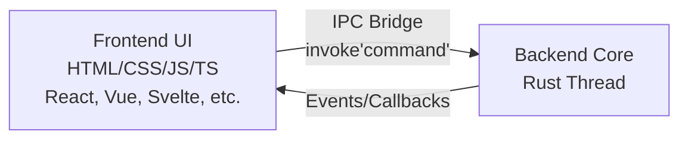

# 💻 Sviluppo App Desktop Cross-Platform con Tauri

[← Server Web & API](../Web/rust_web_services.md) | [Torna all'Hub](../index.md)

---

**Tauri** è un framework moderno per la creazione di applicazioni desktop cross-platform (Windows, macOS, Linux) ed in futuro anche mobile. 

A differenza di **Electron**, che include una copia completa di Chromium e Node.js all'interno di ogni pacchetto (generando installatori pesanti e consumando molta RAM), Tauri utilizza la **WebView nativa del sistema operativo** (Edge/WebView2 su Windows, WebKit su macOS e WebKitGTK su Linux) e affida la gestione del backend a **Rust**. 

Il risultato è un'applicazione estremamente performante, con pacchetti di installazione spesso inferiori ai 5MB.

---

## 1. Architettura di Tauri

L'architettura di Tauri si divide nettamente in due parti che comunicano tramite un ponte asincrono sicuro (IPC - Inter-Process Communication):



1.  **Core Process (Backend - Rust)**: Gestisce il ciclo di vita dell'applicazione, l'accesso al File System, l'integrazione hardware, il database e la sicurezza.
2.  **WebView Process (Frontend - HTML/JS/TS)**: Gestisce solo il rendering dell'interfaccia grafica. Puoi utilizzare qualsiasi framework web (React, Vue, Svelte, HTML statico).

---

## 2. Codice di Esempio: Collegare Frontend e Backend

Di seguito viene mostrato come creare un comando in Rust, registrarlo nel backend di Tauri e richiamarlo dal frontend in Javascript.

### Backend: Codice Rust (`src-tauri/src/main.rs`)
```rust
// Previene l'apertura della finestra terminale su Windows in modalità release
#![cfg_attr(not(debug_assertions), windows_subsystem = "windows")]

use std::sync::Mutex;

// 1. STATO GLOBALE DELL'APPLICAZIONE (Thread Safe)
// Usiamo Mutex e regole di concurrency spiegate in: Ownership & Sicurezza
struct AppState {
    contatore_click: Mutex<i32>,
}

// 2. CREAZIONE DEL COMANDO TAURI
// La macro #[tauri::command] rende la funzione accessibile al frontend via IPC
#[tauri::command]
fn saluta_utente(nome: String) -> String {
    format!("Ciao, {nome}! Questo messaggio proviene direttamente da Rust.")
}

// Comando che legge e modifica lo stato globale
#[tauri::command]
fn incrementa_contatore(stato: tauri::State<'_, AppState>) -> i32 {
    let mut click = stato.contatore_click.lock().unwrap();
    *click += 1;
    *click // Ritorna il valore aggiornato al frontend
}

fn main() {
    tauri::Builder::default()
        // Registra lo stato globale all'avvio dell'app
        .manage(AppState {
            contatore_click: Mutex::new(0),
        })
        // Registra i comandi Rust che il frontend può invocare
        .invoke_handler(tauri::generate_handler![
            saluta_utente, 
            incrementa_contatore
        ])
        .run(tauri::generate_context!())
        .expect("Errore durante l'esecuzione dell'applicazione Tauri");
}
```

### Frontend: Codice Javascript / Typescript (`src/main.js`)
```javascript
// Importiamo la funzione invoke dall'SDK di Tauri
import { invoke } from '@tauri-apps/api/core';

// Riferimenti agli elementi HTML
const inputNome = document.querySelector('#input-nome');
const btnSaluta = document.querySelector('#btn-saluta');
const testoRisposta = document.querySelector('#testo-risposta');

const btnContatore = document.querySelector('#btn-contatore');
const numeroContatore = document.querySelector('#numero-contatore');

// Invocazione di un comando semplice con passaggio parametri
btnSaluta.addEventListener('click', async () => {
    const nome = inputNome.value;
    // Invochiamo il comando Rust asincrono
    const risposta = await invoke('saluta_utente', { nome: nome });
    testoRisposta.textContent = risposta;
});

// Invocazione di un comando che modifica lo stato
btnContatore.addEventListener('click', async () => {
    const conteggioAggiornato = await invoke('incrementa_contatore');
    numeroContatore.textContent = conteggioAggiornato;
});
```

---

## 3. Gestione dello Stato Globale (`tauri::State`)

Tauri consente di salvare strutture dati in memoria persistenti per tutta la durata dell'applicazione.
*   **Registrazione:** Si usa `.manage(LaTuaStruct)` sul builder in `main.rs`.
*   **Iniezione dei Dati:** Nei comandi Rust, basta aggiungere un parametro di tipo `tauri::State<'_, LaTuaStruct>` e Tauri inietterà automaticamente il riferimento corretto.
*   **Sicurezza:** Poiché i comandi Tauri possono essere eseguiti in modo concorrente su thread diversi, lo stato deve essere thread-safe. Si usano tipi come `Mutex<T>` o `RwLock<T>` per sincronizzare i dati (vedi [Concorrenza Sicura](../Core/rust_ownership_safety.md#6-concorrenza-sicura-fearless-concurrency)).

---

## 4. Compilazione Cross-Platform

Tauri compila codice assembly nativo per la piattaforma su cui viene eseguito il comando di build.

*   **Comando di compilazione:** `npm run tauri build` (o `cargo tauri build`).
*   **Pacchetti generati:**
    *   **Windows**: File `.msi` (installatore completo) e `.exe`.
    *   **macOS**: File `.dmg` (immagine disco) e `.app`.
    *   **Linux**: File `.deb` (Debian/Ubuntu) e `.appimage`.

### Compilazione per altri OS (Cross-Compilation)
Tauri richiede l'accesso ai compilatori nativi del sistema per generare i pacchetti. 
*   Per compilare per Windows serve una macchina Windows.
*   Per compilare per macOS serve una macchina macOS.
*   *Best Practice*: Per automatizzare questo processo, si usano le **GitHub Actions** o servizi di CI/CD. Tauri fornisce un template ufficiale (Tauri Action) che compila automaticamente per tutte e tre le piattaforme ad ogni rilascio.

---

[← Server Web & API](../Web/rust_web_services.md) | [Torna all'Hub](../index.md)
