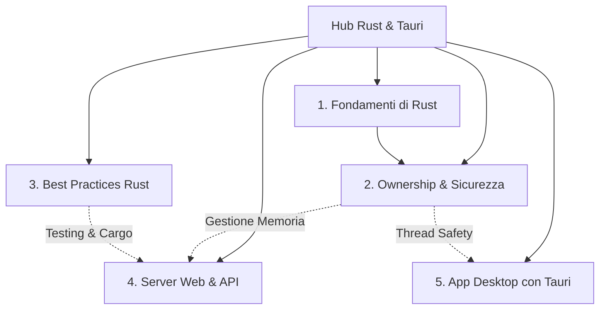

# Hub di Sviluppo Rust & Tauri

Benvenuto nella wiki dedicata allo sviluppo software con **Rust** e alla creazione di applicazioni desktop cross-platform (Linux, macOS, Windows) con **Tauri**. Questa raccolta di note è strutturata per essere interamente navigabile in Obsidian.

---

## 🗺️ Mappa dei Contenuti

Seleziona un argomento per iniziare l'esplorazione delle note:

### 1. 🎯 [Fondamenti di Rust](./rust_fondamenti.md)
*Impara la sintassi base e le caratteristiche uniche del linguaggio.*
*   Variabili, mutabilità e costanti.
*   Tipi di dato primitivi e composti.
*   Funzioni e controllo del flusso.
*   Strutture (`struct`) ed enumerazioni (`enum`).
*   Pattern Matching (`match`, `if let`).
*   Gestione dell'errore robusta con `Option` e `Result`.

### 2. 🛡️ [Ownership & Gestione della Memoria](./rust_ownership_safety.md)
*Il cuore della sicurezza e delle prestazioni di Rust, senza Garbage Collector.*
*   Le regole di **Ownership** (Proprietà).
*   **Borrowing** (Prestito) e le regole dei riferimenti (`&` e `&mut`).
*   **Lifetimes** (Cicli di vita dei riferimenti).
*   **Traits** (Interfacce in Rust) e Polimorfismo.
*   Programmazione asincrona e concorrente.

### 3. 🚀 [Best Practices in Rust](./rust_best_practices.md)
*Scrivere codice idiomatico e mantenere standard elevati.*
*   Utilizzo di `cargo clippy` e `cargo fmt`.
*   Scrittura di test unitari e di integrazione.
*   Gestione delle dipendenze in `Cargo.toml`.
*   Ottimizzazioni per compilazioni veloci e binari leggeri.

### 4. 🌐 [Sviluppo di Server Web & API](./rust_web_services.md)
*Progettare servizi web ad alte prestazioni e a basso consumo di risorse.*
*   I framework principali: **Axum** e **Actix-web**.
*   Runtime asincrono con **Tokio**.
*   Integrazione con database relazionali usando **SQLx**.
*   Gestione di Middleware, Routing e serializzazione JSON con `Serde`.

### 5. 💻 [Applicazioni Cross-Platform con Tauri](./rust_tauri_cross_platform.md)
*Sviluppare app desktop per Linux, macOS e Windows combinando la sicurezza di Rust con il Frontend Web.*
*   Architettura di Tauri: Backend (Rust) vs Frontend (HTML/JS/TS).
*   Configurazione del progetto e comandi Tauri (`#[tauri::command]`).
*   Passaggio di dati (Bridge asincrono).
*   Gestione dello stato globale del backend (`tauri::State`).
*   Compilazione e distribuzione cross-platform.

---

## 🚀 Percorso di Apprendimento Consigliato

1.  Acquisisci familiarità con la sintassi iniziale in [Fondamenti di Rust](./rust_fondamenti.md).
2.  Studia il meccanismo fondamentale dell'**ownership** in [Ownership & Sicurezza](./rust_ownership_safety.md).
3.  Impara a strutturare un servizio backend in [Server Web & API](./rust_web_services.md).
4.  Crea la tua prima interfaccia grafica desktop nativa seguendo la guida [Tauri Cross-Platform](./rust_tauri_cross_platform.md).
